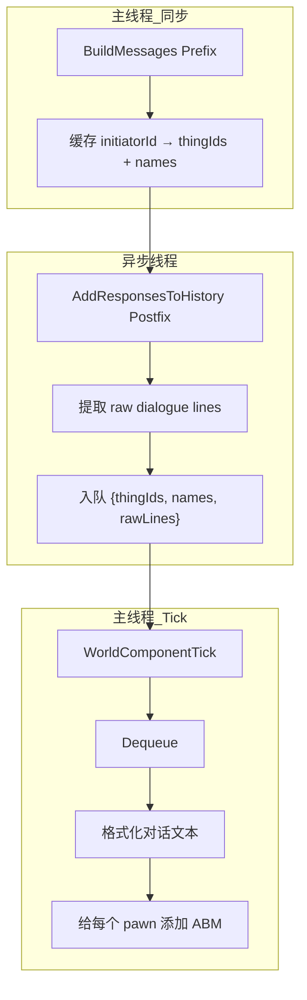

# Проєкт реорганізації системи пам’яті — фінальна версія v5

## 1. Мета

1. **Видалити SCM записи по одному**: більше не створювати SCM під час надходження кожного повідомлення
2. **ABM записувати весь діалог**: зберігати один раунд діалогу як єдине ціле в ABM
3. **Усі учасники отримують спогад**: зокрема pawn, які були присутні, але не говорили
4. **Точне виявлення завершення діалогу**: обробляти в точний момент завершення потокової передачі AI

## 2. Аналіз RimTalk TalkHistory

### Спосіб асинхронної обробки

RimTalk справді безпосередньо обробляє `TalkHistory` в асинхронному потоці:

```csharp
// TalkHistory.cs:37-46
public static void AddMessageHistory(Pawn pawn, string request, string response)
{
    // 使用 ConcurrentDictionary + lock 双重保护
    var messages = MessageHistory.GetOrAdd(pawn.thingIDNumber, _ => []);
    lock (messages)
    {
        messages.Add((Role.User, request));
        messages.Add((Role.AI, response));
    }
}
```

**Причина, чому це можливо**:
- Звертається лише до `pawn.thingIDNumber` (незмінне значення int)
- Працює лише з власною статичною колекцією (ConcurrentDictionary)

**Причина, чому ми не можемо зробити так безпосередньо**:
- Потрібен доступ до `FourLayerMemoryComp` (компонента /RimWorld Unity, потрібен головний потік)
- Потрібно викликати `AddActiveMemory` (може спричинити оновлення UI та інші операції головного потоку)

**Висновок**: зберігаємо режим черги: асинхронно додаємо до черги, обробляємо в головному потоці.

## 3. Основна структура

### Потік даних



### Формат зберігання діалогу

```
[对话参与者：张三、李四、王五]
张三: "你好，今天天气真好。"
李四: "是啊，适合出去打猎。"
```

**Примітка**: Ван У хоча й не сказав жодного слова, але був присутній, тому його включено до списку учасників.

## 4. Структури даних

### DialogueLine (рядок діалогу)

```csharp
/// <summary>
/// 单条对话记录（异步线程提取，不可变）
/// </summary>
public readonly struct DialogueLine
{
    public readonly string SpeakerName;
    public readonly string Text;
    
    public DialogueLine(string speakerName, string text)
    {
        SpeakerName = speakerName;
        Text = text;
    }
}
```

### PendingConversation (діалог в очікуванні обробки)

```csharp
/// <summary>
/// 待处理的对话记录
/// </summary>
public class PendingConversation
{
    /// <summary>
    /// 所有参与者的 ThingID（用于查找 Pawn）
    /// </summary>
    public List<string> ParticipantThingIds { get; set; }
    
    /// <summary>
    /// 所有参与者的名字（主线程缓存，用于格式化）
    /// </summary>
    public List<string> ParticipantNames { get; set; }
    
    /// <summary>
    /// 原始对话行（异步线程提取）
    /// </summary>
    public List<DialogueLine> RawDialogue { get; set; }
    
    /// <summary>
    /// 对话发生的游戏 Tick
    /// </summary>
    public int Timestamp { get; set; }
}
```

## 5. Реалізація Hook

### 5.1 Hook 1: перехоплення учасників (головний потік)

**Файл**: `Source/Patches/Patch_PromptManagerBuildMessages.cs`

```csharp
[HarmonyPatch]
public static class Patch_PromptManagerBuildMessages
{
    /// <summary>
    /// 缓存的参与者信息
    /// </summary>
    public class CachedParticipants
    {
        public List<string> ThingIds { get; set; }
        public List<string> Names { get; set; }
    }
    
    /// <summary>
    /// 参与者缓存 (线程安全)
    /// Key: initiator.ThingID
    /// </summary>
    public static readonly ConcurrentDictionary<string, CachedParticipants> Cache = new();
    
    [HarmonyPrefix]
    public static void Prefix(object talkRequest, List<Pawn> pawns, string status)
    {
        var initiator = GetInitiator(talkRequest);
        if (initiator == null || pawns == null) return;
        
        // 在主线程中提取所有信息
        var cached = new CachedParticipants
        {
            ThingIds = pawns.Select(p => p.ThingID).ToList(),
            Names = pawns.Select(p => p.LabelShort).ToList()
        };
        
        Cache[initiator.ThingID] = cached;
    }
}
```

### 5.2 Hook 2: перехоплення діалогу (асинхронно)

**Файл**: `Source/Patches/Patch_AddResponsesToHistory.cs`

```csharp
[HarmonyPatch]
public static class Patch_AddResponsesToHistory
{
    public static readonly ConcurrentQueue<PendingConversation> Queue = new();
    
    [HarmonyPostfix]
    public static void Postfix(object responses, string prompt)
    {
        // 1. 提取原始对话行（异步安全，只读取值类型/字符串）
        var rawLines = ExtractDialogueLines(responses);
        if (rawLines.Count == 0) return;
        
        // 2. 从第一个说话者反推 initiator
        string initiatorId = GetInitiatorId(rawLines[0].SpeakerName);
        if (initiatorId == null) return;
        
        // 3. 获取缓存的参与者信息
        if (!Patch_PromptManagerBuildMessages.Cache.TryRemove(initiatorId, out var cached))
            return;
        
        // 4. 入队（主线程会处理格式化）
        Queue.Enqueue(new PendingConversation
        {
            ParticipantThingIds = cached.ThingIds,
            ParticipantNames = cached.Names,
            RawDialogue = rawLines,
            Timestamp = GetCurrentTick()
        });
    }
    
    private static List<DialogueLine> ExtractDialogueLines(object responses)
    {
        var lines = new List<DialogueLine>();
        var list = responses as IList;
        if (list == null) return lines;
        
        foreach (var response in list)
        {
            var type = response.GetType();
            var name = type.GetProperty("Name")?.GetValue(response) as string;
            var text = type.GetProperty("Text")?.GetValue(response) as string;
            
            if (!string.IsNullOrEmpty(text))
            {
                lines.Add(new DialogueLine(name ?? "???", text));
            }
        }
        
        return lines;
    }
}
```

### 5.3 Обробка в головному потоці (форматування + збереження)

**Файл**: `Source/Memory/MemoryManager.cs`

```csharp
private void ProcessConversationQueue()
{
    while (Patch_AddResponsesToHistory.Queue.TryDequeue(out var record))
    {
        // 在主线程格式化对话文本
        string formattedText = FormatConversation(record);
        
        // 查找所有参与者的 Pawn
        var pawns = FindPawnsByThingIds(record.ParticipantThingIds);
        
        // 给每个参与者添加 ABM
        foreach (var pawn in pawns)
        {
            var comp = pawn.TryGetComp<FourLayerMemoryComp>();
            comp?.AddActiveMemory(
                formattedText,
                MemoryType.Conversation,
                importance: 0.6f
            );
        }
    }
}

private string FormatConversation(PendingConversation record)
{
    var sb = new StringBuilder();
    
    // 第一行：参与者列表
    sb.AppendLine($"[对话参与者：{string.Join("、", record.ParticipantNames)}]");
    
    // 对话内容
    foreach (var line in record.RawDialogue)
    {
        sb.AppendLine($"{line.SpeakerName}: \"{line.Text}\"");
    }
    
    return sb.ToString().TrimEnd();
}
```

## 6. Контрольний список реалізації

### Фаза 1: створення структур даних
- [ ] Створити `Source/Memory/PendingConversation.cs` (містить DialogueLine)

### Фаза 2: реалізація Hooks
- [ ] Створити `Source/Patches/Patch_PromptManagerBuildMessages.cs`
- [ ] Створити `Source/Patches/Patch_AddResponsesToHistory.cs`

### Фаза 3: Інтеграція обробки в головний потік
- [ ] Змінити `Source/Memory/MemoryManager.cs`, додавши обробку черги

### Фаза 4: Очищення старого коду
- [ ] Вимкнути логіку поетапного запису в `Source/Patches/RimTalkConversationCapturePatch.cs`

### Фаза 5: Тестування
- [ ] Протестувати монолог одного персонажа
- [ ] Протестувати діалог двох персонажів
- [ ] Протестувати діалог кількох персонажів (3+ персонажів)
- [ ] Перевірити, що учасники, які не говорили, також отримують спогади

## 7. Перелік файлів

| Файл | Операція | Опис |
|------|------|------|
| `Source/Memory/PendingConversation.cs` | Створити | Структура даних |
| `Source/Patches/Patch_PromptManagerBuildMessages.cs` | Створити | Hook: кешування учасників |
| `Source/Patches/Patch_AddResponsesToHistory.cs` | Створено | Hook: отримання діалогу та додавання в чергу |
| `Source/Memory/MemoryManager.cs` | Змінено | Додано обробку та форматування черги |
| `Source/Patches/RimTalkConversationCapturePatch.cs` | Змінено | Вимкнено стару логіку |

## 8. Переваги рішення

| Властивість | Опис |
|------|------|
| **Точне виявлення** | Спрацьовує в точний момент завершення потокової передачі AI |
| **Форматування в головному потоці** | Форматування виконується в головному потоці, тому всі дані можна безпечно отримати |
| **Потокобезпечність** | Асинхронно отримуються лише незмінні дані, а компоненти піша обробляються в головному потоці |
| **Повне охоплення** | Усі учасники, зокрема ті, хто не говорив, отримують спогади |
| **Зрозумілий формат** | Містить список учасників, що полегшує розуміння контексту діалогу |